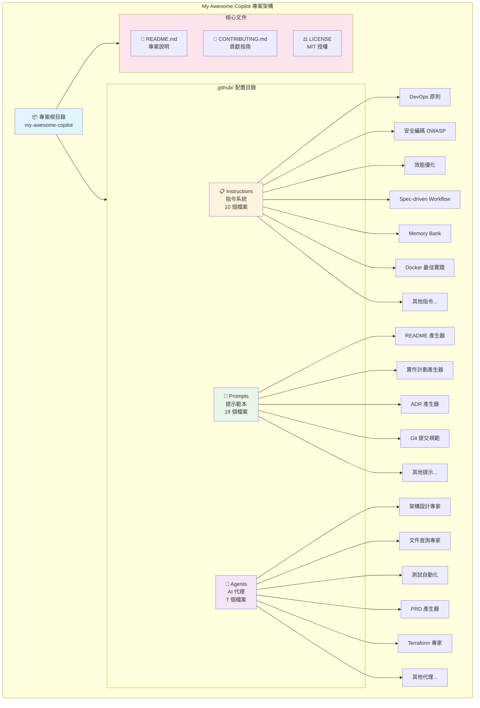
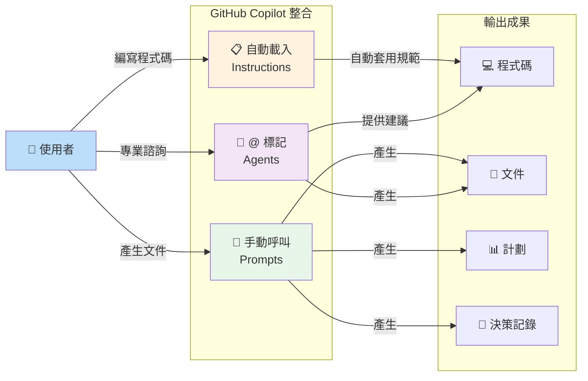

# My Awesome Copilot

一個精心設計的 GitHub Copilot 指令和提示集合，旨在提升開發者體驗並促進最佳實踐的採用。

> A curated collection of GitHub Copilot instructions and prompts designed to enhance developer experience and promote best practices.

[](LICENSE)
[](https://github.com/rockexe0000/my-awesome-copilot/issues)
[](https://github.com/rockexe0000/my-awesome-copilot/stargazers)
[](CONTRIBUTING.md)

## 目錄 / Table of Contents

### 📋 核心文件
- [專案概述 / Project Overview](#專案概述--project-overview)
- [核心特色 / Key Features](#核心特色--key-features)
- [系統架構 / System Architecture](#系統架構--system-architecture)

### 🚀 快速開始
- [快速開始 / Quick Start](#快速開始--quick-start)
- [專案結構 / Project Structure](#專案結構--project-structure)
- [AI 代理清單 / AI Agents](#ai-代理清單--ai-agents)

### 📚 詳細指南
- [指令系統 / Instructions System](#指令系統--instructions-system)
- [提示範本 / Prompt Templates](#提示範本--prompt-templates)
- [使用範例 / Usage Examples](#使用範例--usage-examples)

### 🔧 最佳實踐與規範
- [最佳實踐 / Best Practices](#最佳實踐--best-practices)
- [文件管理建議 / Documentation Management](#文件管理建議--documentation-management)

### 🤝 社群與支援
- [貢獻 / Contributing](#貢獻--contributing)
- [支援 / Support](#支援--support)
- [授權 / License](#授權--license)

### 🔍 快速查找

| 我想要... | 前往章節 |
|----------|----------|
| 了解專案背景與目標 | [專案概述](#專案概述--project-overview) |
| 查看系統架構圖 | [系統架構](#系統架構--system-architecture) |
| 快速啟動專案 | [快速開始](#快速開始--quick-start) |
| 查看所有 AI 代理 | [AI 代理清單](#ai-代理清單--ai-agents) |
| 了解指令系統 | [指令系統](#指令系統--instructions-system) |
| 瀏覽提示範本 | [提示範本](#提示範本--prompt-templates) |
| 學習使用範例 | [使用範例](#使用範例--usage-examples) |
| 檔案命名規範 | [最佳實踐](#最佳實踐--best-practices) |
| 回報問題或貢獻 | [貢獻](#貢獻--contributing) |

## 專案概述 / Project Overview

My Awesome Copilot 是一個全面的 GitHub Copilot 指令和提示系統，專為提升軟體開發效率與程式碼品質而設計。本專案整合了業界最佳實踐、安全規範和效能優化策略，透過結構化的指令系統和可重用的提示範本,幫助開發團隊建立一致的開發標準。

> My Awesome Copilot is a comprehensive GitHub Copilot instructions and prompts system designed to enhance software development efficiency and code quality. This project integrates industry best practices, security standards, and performance optimization strategies through structured instruction systems and reusable prompt templates, helping development teams establish consistent development standards.

### 核心目標 / Core Goals

- **標準化開發實踐** - 通過一致的指令確保程式碼品質和架構決策
- **提升開發效率** - 提供現成的提示範本來處理常見的開發任務
- **促進最佳實踐** - 整合 DevOps、安全性、效能最佳化等業界標準
- **增強程式碼品質** - 透過自動化檢查和建議來維持高程式碼標準

## 核心特色 / Key Features

### 🎯 全面的指令系統

涵蓋軟體開發全生命週期的指令集:
- **DevOps 核心原則** - CALMS 框架與 DORA 四大指標
- **安全編碼規範** - 基於 OWASP Top 10 的安全指導
- **效能最佳化** - 前端、後端、資料庫全方位優化策略
- **開發流程管理** - Spec-driven Workflow 六階段開發循環
- **容器化最佳實踐** - Docker 映像優化與安全掃描

### 📝 豐富的提示範本

預建的提示檔案用於常見開發工作流程:
- **README 產生器** - 智慧型雙語文件產生 (繁中/英文)
- **實作計劃管理** - 結構化的開發計畫建立與追蹤
- **架構決策記錄** - ADR 文件自動化產生
- **程式碼審查工具** - 自動化程式碼品質檢查與重構建議
- **標準化 Git 提交** - Conventional Commits 規範整合

### 🤖 智慧 AI 代理

內建 7 個專業 AI 代理,涵蓋架構、測試、文件等領域:
- **架構設計專家** - 產生完整的架構圖表與 NFR 分析
- **文件查詢專家** - 即時查詢最新函式庫文件
- **測試自動化** - Playwright 測試腳本產生與執行
- **PRD 產生器** - 產品需求文件自動化建立
- **Terraform 專家** - IaC 最佳實踐與自動化部署

### 🔄 記憶體銀行系統

維持專案上下文和進度追蹤:
- 專案知識持久化儲存
- 任務狀態自動追蹤
- 決策歷史記錄
- 多會話上下文保持

## 系統架構 / System Architecture

### 專案組織結構圖



### 工作流程圖



### 三大核心系統

| 系統 | 類型 | 觸發方式 | 數量 | 主要用途 |
|------|------|---------|------|---------|
| **Instructions** | 自動 | 根據檔案類型自動載入 | 10 個 | 程式碼生成規範、最佳實踐自動套用 |
| **Prompts** | 手動 | 使用 `Follow instructions in [file.prompt.md]` | 19 個 | 文件產生、計劃建立、程式碼審查 |
| **Agents** | 互動 | 使用 `@agent-name` 標記 | 7 個 | 專業領域諮詢、架構設計、測試自動化 |

## 快速開始 / Quick Start

## Agents 代理清單

本專案內建多種 AI 代理 (agents)，每個 agent 皆有明確分工，支援架構設計、測試、產品規格、工程指導與基礎設施自動化。

| Agent 名稱 | 檔案 | 主要職責 | 核心特色 |
|------------|-------------------------------|--------------------------------------------------|--------------------------------------------------|
| **Senior Cloud Architect** | [arch.agent.md](.github/agents/arch.agent.md) | 現代架構設計模式專家，NFR 需求分析，建立全面的架構圖表和文件 | • 不產生程式碼，專注架構設計<br>• 必須產生 6 種 Mermaid 圖表（系統上下文、元件、部署、資料流、時序、其他相關圖）<br>• 分階段開發方法（Initial Phase → Final Phase）<br>• NFR 詳細分析（可擴展性、效能、安全性、可靠性、可維護性）<br>• 輸出格式：`{app}_Architecture.md` |
| **Context7 Documentation Expert** | [context7.agent.md](.github/agents/context7.agent.md) | 函式庫/框架最新文件查詢專家，版本升級建議與 API 精確性保證 | • **強制使用 Context7 MCP** 查詢最新官方文件<br>• 禁止憑記憶或訓練資料回答<br>• 自動版本比對（當前 vs 最新）<br>• 多語言生態系統支援（JS/TS, Python, Ruby, Go, Rust, PHP, Java, .NET）<br>• 升級指南自動產生（Breaking Changes、Migration Steps）<br>• 工作流程：`resolve-library-id` → `get-library-docs` → 版本檢查 → 回答 |
| **Critical Thinking Mode** | [critical-thinking.agent.md](.github/agents/critical-thinking.agent.md) | 挑戰假設，促進批判性思考，確保最佳解決方案和結果 | • 不提供解決方案或直接答案<br>• 持續追問「為什麼」（Why）<br>• 扮演魔鬼代言人角色<br>• 戰略性長期影響思考<br>• 細節導向但簡潔問題<br>• 一次專注一個問題 |
| **Playwright Tester Mode** | [playwright-tester.agent.md](.github/agents/playwright-tester.agent.md) | Playwright 測試專家，網站探索、測試產生與執行、測試改進 | • **使用 Playwright MCP** 導航網站<br>• 先探索網站再產生測試（不提前編碼）<br>• TypeScript 測試產生<br>• 測試執行、診斷失敗、迭代修正<br>• 結構化可維護測試<br>• 功能摘要文件化 |
| **Create PRD Chat Mode** | [prd.agent.md](.github/agents/prd.agent.md) | 產品需求文件（PRD）產生專家，用戶故事、驗收標準、技術考量 | • 產生完整 `prd.md` 文件<br>• 先提問釐清需求（3-5 個問題）<br>• 分析程式碼庫以了解現有架構<br>• 唯一需求 ID（GH-001）<br>• 可測試的用戶故事與驗收標準<br>• 支援自動建立 GitHub Issues |
| **Principal Software Engineer** | [principal-software-engineer.agent.md](.github/agents/principal-software-engineer.agent.md) | 首席工程師級指導，工程卓越、技術領導、務實實作（Martin Fowler 風格） | • 工程基礎原則（Gang of Four, SOLID, DRY, YAGNI, KISS）<br>• 清晰程式碼實踐<br>• 測試金字塔策略（單元、整合、端對端）<br>• **技術債務自動管理**（使用 `create_issue` 追蹤）<br>• 需求分析與風險評估<br>• 平衡工程卓越與交付需求 |
| **Terraform Agent** | [terraform.agent.md](.github/agents/terraform.agent.md) | Terraform IaC 專家，自動化 HCP Terraform 工作流程，基礎設施最佳實踐 | • **使用 Terraform MCP Server** 自動化<br>• Registry 智慧查詢（Public + Private）<br>• 自動解析最新 Provider/Module 版本<br>• HCP Terraform Workspace 管理<br>• Run 編排（Plan → Apply）<br>• **2-space 縮排，對齊 `=`**<br>• 必須包含檔案：`main.tf`, `variables.tf`, `outputs.tf`, `README.md`<br>• Backend 配置自動產生 |

### Agent 使用方式

每個 agent 皆有獨立的指令集與工作流程，詳情請參閱 [`.github/agents/`](.github/agents/) 目錄下的對應檔案。

**在 GitHub Copilot Chat 中啟用 Agent：**
```
@<agent-name> <your-question>
```

**範例：**
- `@arch` - 啟用 Senior Cloud Architect
- `@context7` - 啟用 Context7 Documentation Expert
- `@playwright` - 啟用 Playwright Tester Mode
- `@terraform` - 啟用 Terraform Agent

## 目錄 / Table of Contents

- [概述](#概述)
- [特色功能](#特色功能)
- [快速開始](#快速開始)
  - [使用方式](#使用方式)
  - [整合到現有專案](#整合到現有專案)
- [快速參考索引](#快速參考索引)
  - [📋 依功能分類](#-依功能分類)
    - [開發流程與專案管理](#開發流程與專案管理)
    - [程式碼品質與規範](#程式碼品質與規範)
    - [安全性](#安全性)
    - [效能優化](#效能優化)
    - [DevOps 與容器化](#devops-與容器化)
    - [文件與藍圖產生](#文件與藍圖產生)
    - [開發輔助工具](#開發輔助工具)
  - [🔍 快速搜尋表](#-快速搜尋表)
- [核心組件](#核心組件)
  - [🔧 指令系統 (Instructions)](#-指令系統-instructions)
    - [開發流程與專案管理](#開發流程與專案管理-1)
      - [spec-driven-workflow-v1.instructions.md](#spec-driven-workflow-v1instructionsmd)
      - [memory-bank.instructions.md](#memory-bankinstructionsmd)
      - [copilot-thought-logging.instructions.md](#copilot-thought-logginginstructionsmd)
    - [程式碼品質與規範](#程式碼品質與規範-1)
      - [self-explanatory-code-commenting.instructions.md](#self-explanatory-code-commentinginstructionsmd)
      - [taming-copilot.instructions.md](#taming-copilotinstructionsmd)
      - [markdown.instructions.md](#markdowninstructionsmd)
    - [安全性](#安全性-1)
      - [security-and-owasp.instructions.md](#security-and-owaspinstructionsmd)
    - [效能優化](#效能優化-1)
      - [performance-optimization.instructions.md](#performance-optimizationinstructionsmd)
    - [DevOps 與容器化](#devops-與容器化-1)
      - [devops-core-principles.instructions.md](#devops-core-principlesinstructionsmd)
      - [containerization-docker-best-practices.instructions.md](#containerization-docker-best-practicesinstructionsmd)
  - [📝 提示範本 (Prompts)](#-提示範本-prompts)
    - [文件與藍圖產生](#文件與藍圖產生-1)
      - [create-readme-comprehensive.prompt.md ⭐](#create-readme-comprehensivepromptmd--推薦)
      - [create-readme-quick.prompt.md](#create-readme-quickpromptmd)
      - [copilot-instructions-blueprint-generator.prompt.md](#copilot-instructions-blueprint-generatorpromptmd)
      - [readme-blueprint-generator.prompt.md](#readme-blueprint-generatorpromptmd)
      - [technology-stack-blueprint-generator.prompt.md](#technology-stack-blueprint-generatorpromptmd)
      - [create-agents.md.prompt.md](#create-agentsmdpromptmd)
      - [create-architectural-decision-record.prompt.md](#create-architectural-decision-recordpromptmd)
      - [documentation-writer.prompt.md](#documentation-writerpromptmd)
    - [開發輔助工具](#開發輔助工具-1)
      - [conventional-commit.prompt.md](#conventional-commitpromptmd)
      - [create-implementation-plan.prompt.md](#create-implementation-planpromptmd)
      - [update-implementation-plan.prompt.md](#update-implementation-planpromptmd)
      - [update-specification.prompt.md](#update-specificationpromptmd)
      - [prompt-builder.prompt.md](#prompt-builderpromptmd)
    - [程式碼品質與維護](#程式碼品質與維護)
      - [review-and-refactor.prompt.md](#review-and-refactorpromptmd)
      - [update-markdown-file-index.prompt.md](#update-markdown-file-indexpromptmd)
      - [update-oo-component-documentation.prompt.md](#update-oo-component-documentationpromptmd)
    - [專案發現與建議](#專案發現與建議)
      - [suggest-awesome-github-copilot-instructions.prompt.md](#suggest-awesome-github-copilot-instructionspromptmd)
      - [suggest-awesome-github-copilot-prompts.prompt.md](#suggest-awesome-github-copilot-promptspromptmd)
- [使用範例](#使用範例)
  - [情境 1: 開始新專案](#情境-1-開始新專案)
  - [情境 2: 開發新功能](#情境-2-開發新功能)
  - [情境 3: 提升程式碼品質](#情境-3-提升程式碼品質)
  - [情境 4: 容器化部署](#情境-4-容器化部署)
  - [情境 5: 標準化 Git 工作流程](#情境-5-標準化-git-工作流程)
- [最佳實踐](#最佳實踐)
  - [指令檔案自訂](#指令檔案自訂)
  - [提示有效使用](#提示有效使用)
- [進階功能](#進階功能)
  - [記憶體銀行系統](#記憶體銀行系統)
  - [規格驅動工作流程](#規格驅動工作流程)
- [貢獻](#貢獻)
- [支援](#支援)
- [授權](#授權)

## 快速開始 / Quick Start

### 安裝 / Installation

```bash
# 複製專案儲存庫 (Clone repository)
git clone https://github.com/rockexe0000/my-awesome-copilot.git
cd my-awesome-copilot
```

### 整合到現有專案 / Integration

#### 方法 1: 複製指令檔案 (Copy Instructions)

```bash
# 複製指令檔案到您的專案 (Copy instructions to your project)
cp -r .github/instructions /path/to/your/project/.github/

# 複製提示範本 (Copy prompt templates)
cp -r .github/prompts /path/to/your/project/.github/

# 複製 AI 代理 (Optional: Copy AI agents)
cp -r .github/agents /path/to/your/project/.github/
```

#### 方法 2: Git Submodule (Recommended)

```bash
# 在您的專案中加入為 submodule (Add as submodule)
cd /path/to/your/project
git submodule add https://github.com/rockexe0000/my-awesome-copilot.git .github/copilot-config

# 建立符號連結 (Create symbolic links)
ln -s .github/copilot-config/.github/instructions .github/instructions
ln -s .github/copilot-config/.github/prompts .github/prompts
```

### 基本使用 / Basic Usage

#### 使用指令 / Using Instructions

GitHub Copilot 會自動讀取 `.github/instructions/` 目錄下的指令檔案。指令會根據 `applyTo` 欄位自動套用到對應的檔案類型。

> [!TIP]
> 指令檔案使用 YAML front matter 定義適用範圍。例如:
> ```yaml
> ---
> applyTo: '**/*.ts'
> description: 'TypeScript coding standards'
> ---
> ```

#### 使用提示範本 / Using Prompt Templates

在 GitHub Copilot Chat 中使用 `/` 指令啟動提示範本:

```markdown
# 產生繁中雙語 README (推薦)
# Generate bilingual README (Recommended)
Follow instructions in [create-readme-comprehensive.prompt.md](file:///.github/prompts/create-readme-comprehensive.prompt.md)

# 產生英文 README (快速)
# Generate English README (Quick)
Follow instructions in [create-readme-quick.prompt.md](file:///.github/prompts/create-readme-quick.prompt.md)

# 標準化 Git 提交訊息
# Standardize Git commit message
Follow instructions in [conventional-commit.prompt.md](file:///.github/prompts/conventional-commit.prompt.md)
```

#### 使用 AI 代理 / Using AI Agents

在 GitHub Copilot Chat 中使用 `@` 標記啟用代理:

```bash
# 架構設計諮詢 (Architecture design consultation)
@arch 請幫我設計一個微服務架構

# 查詢最新函式庫文件 (Query latest library documentation)
@context7 React 18 的新功能有哪些?

# 建立 PRD 文件 (Create PRD document)
@prd 我需要一個使用者認證系統的需求文件
```

## 專案結構 / Project Structure

```
my-awesome-copilot/
├── .github/
│   ├── agents/                    # AI 代理配置 (AI Agents Configuration)
│   │   ├── arch.agent.md         # 架構設計專家 (Architecture Expert)
│   │   ├── context7.agent.md     # 文件查詢專家 (Documentation Expert)
│   │   ├── critical-thinking.agent.md  # 批判思考模式 (Critical Thinking)
│   │   ├── playwright-tester.agent.md  # 測試自動化 (Test Automation)
│   │   ├── prd.agent.md          # PRD 產生器 (PRD Generator)
│   │   ├── principal-software-engineer.agent.md  # 首席工程師 (Principal Engineer)
│   │   └── terraform.agent.md    # Terraform 專家 (Terraform Expert)
│   │
│   ├── instructions/              # GitHub Copilot 指令 (Instructions)
│   │   ├── devops-core-principles.instructions.md
│   │   ├── security-and-owasp.instructions.md
│   │   ├── performance-optimization.instructions.md
│   │   ├── spec-driven-workflow-v1.instructions.md
│   │   ├── memory-bank.instructions.md
│   │   ├── containerization-docker-best-practices.instructions.md
│   │   ├── self-explanatory-code-commenting.instructions.md
│   │   ├── taming-copilot.instructions.md
│   │   ├── copilot-thought-logging.instructions.md
│   │   └── markdown.instructions.md
│   │
│   └── prompts/                   # 提示範本 (Prompt Templates)
│       ├── create-readme-comprehensive.prompt.md  # ⭐ 推薦
│       ├── create-readme-quick.prompt.md
│       ├── copilot-instructions-blueprint-generator.prompt.md
│       ├── technology-stack-blueprint-generator.prompt.md
│       ├── conventional-commit.prompt.md
│       ├── create-implementation-plan.prompt.md
│       ├── create-architectural-decision-record.prompt.md
│       ├── review-and-refactor.prompt.md
│       └── ... (更多範本 / more templates)
│
├── CONTRIBUTING.md               # 貢獻指南 (Contributing Guide)
├── LICENSE                       # MIT 授權 (MIT License)
└── README.md                     # 本檔案 (This file)
```

### 目錄說明 / Directory Description

| 目錄 / Directory | 用途 / Purpose |
|-----------------|---------------|
| `.github/agents/` | AI 代理配置檔案,提供專業領域的輔助功能 |
| `.github/instructions/` | GitHub Copilot 指令,定義程式碼產生規則和最佳實踐 |
| `.github/prompts/` | 可重用的提示範本,用於常見開發任務 |

## 快速參考索引

### 📋 依功能分類

#### 開發流程與專案管理
- [Spec-driven Workflow](#spec-driven-workflow-v1instructionsmd) - 規格驅動的六階段開發循環
- [Memory Bank](#memory-bankinstructionsmd) - 專案上下文與進度追蹤系統
- [Copilot Thought Logging](#copilot-thought-logginginstructionsmd) - Copilot 處理過程追蹤

#### 程式碼品質與規範
- [Self-explanatory Code Commenting](#self-explanatory-code-commentinginstructionsmd) - 自我解釋的程式碼註解指南
- [Taming Copilot](#taming-copilotinstructionsmd) - 精確控制 Copilot 行為
- [Markdown](#markdowninstructionsmd) - Markdown 文件撰寫規範

#### 安全性
- [Security and OWASP](#security-and-owaspinstructionsmd) - OWASP Top 10 安全編碼實踐

#### 效能優化
- [Performance Optimization](#performance-optimizationinstructionsmd) - 全方位效能最佳化指南

#### DevOps 與容器化
- [DevOps Core Principles](#devops-core-principlesinstructionsmd) - DevOps 核心原則與 DORA 指標
- [Containerization Docker Best Practices](#containerization-docker-best-practicesinstructionsmd) - Docker 容器化最佳實踐

#### 文件與藍圖產生
- [Create README (Comprehensive)](#create-readme-comprehensivepromptmd-推薦) - 智慧型雙語 README 產生器
- [Create README (Quick)](#create-readme-quickpromptmd) - 快速英文 README 產生器
- [Copilot Instructions Blueprint Generator](#copilot-instructions-blueprint-generatorpromptmd) - 產生 Copilot 指令檔案
- [README Blueprint Generator](#readme-blueprint-generatorpromptmd) - 基於現有文件產生 README
- [Technology Stack Blueprint Generator](#technology-stack-blueprint-generatorpromptmd) - 技術堆疊文件產生器

#### 開發輔助工具
- [Conventional Commit](#conventional-commitpromptmd) - 標準化 Git 提交訊息
- [Create Implementation Plan](#create-implementation-planpromptmd) - 建立實作計劃
- [Create Architectural Decision Record](#create-architectural-decision-recordpromptmd) - 建立 ADR 文件

### 🔍 快速搜尋表

| 我想要... | 使用這個檔案 |
|----------|-------------|
| 建立繁中雙語 README (推薦) | [create-readme-comprehensive.prompt.md](#create-readme-comprehensivepromptmd-推薦) |
| 建立英文 README (快速) | [create-readme-quick.prompt.md](#create-readme-quickpromptmd) |
| 設定 Copilot 指令 | [copilot-instructions-blueprint-generator.prompt.md](#copilot-instructions-blueprint-generatorpromptmd) |
| 追蹤專案進度 | [memory-bank.instructions.md](#memory-bankinstructionsmd) |
| 提升程式碼安全性 | [security-and-owasp.instructions.md](#security-and-owaspinstructionsmd) |
| 優化應用效能 | [performance-optimization.instructions.md](#performance-optimizationinstructionsmd) |
| 標準化 Git 提交 | [conventional-commit.prompt.md](#conventional-commitpromptmd) |
| 建立實作計劃 | [create-implementation-plan.prompt.md](#create-implementation-planpromptmd) |
| 審查和重構程式碼 | [review-and-refactor.prompt.md](#review-and-refactorpromptmd) |
| 設定 Docker 容器 | [containerization-docker-best-practices.instructions.md](#containerization-docker-best-practicesinstructionsmd) |
| 遵循 DevOps 實踐 | [devops-core-principles.instructions.md](#devops-core-principlesinstructionsmd) |

## 核心組件

本專案包含完整的 GitHub Copilot 指令系統和提示範本,按功能分類如下:

### 🔧 指令系統 (Instructions)

#### 開發流程與專案管理

##### spec-driven-workflow-v1.instructions.md

[查看完整檔案](.github/instructions/spec-driven-workflow-v1.instructions.md)

- **適用範圍**: `**` (所有檔案)
- **描述**: 規格驅動工作流程 v1 提供結構化的軟體開發方法,確保需求清晰定義、設計仔細規劃、實作徹底記錄和驗證
- **核心功能**:
  - 六階段執行循環 (分析 ANALYZE、設計 DESIGN、實作 IMPLEMENT、驗證 VALIDATE、反思 REFLECT、交接 HANDOFF)
  - EARS 表示法需求定義 (事件驅動、狀態驅動、不期望行為等)
  - 詳細的實作計畫追蹤
  - 基於信心分數的自適應執行策略 (高/中/低信心不同處理方式)
  - 技術債務自動管理與優先級排序
  - 品質保證自動化 (靜態分析、動態分析、文件檢查)
  - 結構化的 Action 文件範本和 Decision Record 範本
- **使用場景**:
  - 開發新功能時遵循標準化流程
  - 管理複雜的重構任務
  - 確保需求可測試和可追溯
  - 進行技術債務評估
  - 建立可維護的專案文件

##### memory-bank.instructions.md

[查看完整檔案](.github/instructions/memory-bank.instructions.md)

- **適用範圍**: `**` (所有檔案)
- **描述**: 專案知識、領域知識和偏好設定的記憶庫系統,用於在 AI 會話重置後保持專案上下文
- **核心功能**:
  - Memory Bank 檔案結構 (projectbrief.md, productContext.md, systemPatterns.md, techContext.md, activeContext.md, progress.md)
  - 任務管理系統 (tasks/ 資料夾,包含任務索引和個別任務檔案)
  - 三種工作流程模式 (Plan Mode, Act Mode, Task Management)
  - 自動化文件更新機制
  - 專案智能學習系統 (instructions)
  - 任務命令 (add task, update task, show tasks)
- **使用場景**:
  - 在會話重置後快速恢復專案上下文
  - 追蹤長期專案進度和決策歷史
  - 管理複雜的多任務專案
  - 保存和傳承專案知識
  - 建立團隊共享的專案記憶

##### copilot-thought-logging.instructions.md

[查看完整檔案](.github/instructions/copilot-thought-logging.instructions.md)

- **適用範圍**: `**` (所有檔案)
- **描述**: 在 Copilot 處理過程中查看其遵循的流程,可編輯以重塑互動或在需要後續追蹤時儲存
- **核心功能**:
  - 建立 `\Copilot-Processing.md` 追蹤處理過程
  - 四階段執行 (初始化、規劃、執行、摘要)
  - 追蹤每個階段的完成狀態
  - 詳細的行動項目規劃和追蹤
  - 強制執行階段順序 (不可跳過、不可合併)
  - 靜默工作模式 (減少狀態更新輸出)
- **使用場景**:
  - 需要追蹤複雜任務的執行進度
  - 多步驟任務需要系統化管理
  - 需要記錄 Copilot 的決策過程
  - 調試 Copilot 行為問題

#### 程式碼品質與規範

##### self-explanatory-code-commenting.instructions.md

[查看完整檔案](.github/instructions/self-explanatory-code-commenting.instructions.md)

- **適用範圍**: `**` (所有檔案)
- **描述**: GitHub Copilot 編寫註解的指南,以達到自我解釋的程式碼,減少不必要的註解
- **核心功能**:
  - 避免明顯、冗餘、過時的註解
  - 只在必要時解釋「為什麼」(WHY),而非「什麼」(WHAT)
  - 複雜商業邏輯、非明顯演算法、正規表示式的註解指導
  - API 約束和陷阱的文件化
  - 公開 API 的 JSDoc/docstring 範本
  - 註解標註系統 (TODO, FIXME, HACK, NOTE, WARNING, PERF, SECURITY, BUG, REFACTOR, DEPRECATED)
  - 決策框架 (四個關鍵問題)
  - 反模式識別 (死程式碼註解、變更日誌註解、裝飾性註解)
- **使用場景**:
  - 程式碼審查時評估註解品質
  - 撰寫新功能時決定是否需要註解
  - 重構程式碼以提高可讀性
  - 建立團隊程式碼註解標準
  - 清理過時或無用的註解

##### taming-copilot.instructions.md

[查看完整檔案](.github/instructions/taming-copilot.instructions.md)

- **適用範圍**: `**` (所有檔案)
- **描述**: 防止 Copilot 在程式碼庫中造成破壞,保持其受控
- **核心功能**:
  - 核心指令層級 (使用者指令優先、事實驗證優於內部知識、遵循哲學)
  - 僅在要求時提供程式碼區塊
  - 直接簡潔的回應風格
  - 遵循業界最佳實踐和標準模式
  - 極簡和標準程式碼生成 (簡單優先、標準函式庫優先)
  - 外科手術式程式碼修改 (保留現有程式碼、最小必要變更)
  - 智慧工具使用 (宣告意圖、專注於目標)
- **使用場景**:
  - 需要精確控制 Copilot 行為
  - 避免不必要的程式碼重構
  - 確保最小化程式碼變更
  - 維護現有程式碼結構和風格
  - 防止過度工程化

##### markdown.instructions.md

[查看完整檔案](.github/instructions/markdown.instructions.md)

- **適用範圍**: `**/*.md`
- **描述**: 文件和內容建立標準
- **核心功能**:
  - Markdown 格式規範 (標題層級、清單格式、程式碼區塊、連結、圖片、表格)
  - 行長度限制 (最多 400 字元)
  - YAML front matter 要求 (description, applyTo 等)
  - 文件結構最佳實踐
  - 驗證需求和檢查清單
- **使用場景**:
  - 撰寫專案文件
  - 建立技術部落格文章
  - 維護 README 檔案
  - 生成規格文件
  - 確保文件格式一致性

#### 安全性

##### security-and-owasp.instructions.md

[查看完整檔案](.github/instructions/security-and-owasp.instructions.md)

- **適用範圍**: `*` (所有檔案)
- **描述**: 基於 OWASP Top 10 和業界最佳實務的全面安全編碼指令,適用於所有語言和框架
- **核心功能**:
  - A01: 存取控制和 SSRF 防護 (最小權限原則、預設拒絕、URL 驗證、路徑遍歷防護)
  - A02: 加密失敗防範 (強演算法、傳輸加密、靜態加密、金鑰管理)
  - A03: 注入攻擊防護 (參數化查詢、命令列清理、XSS 防護)
  - A05: 安全配置 (預設安全、安全標頭)
  - A06: 元件漏洞管理 (依賴項更新、漏洞掃描)
  - A07: 身份驗證和會話管理 (會話固定防護、安全 Cookie、暴力破解防護)
  - A08: 資料完整性 (反序列化安全)
- **使用場景**:
  - 實施安全的使用者認證系統
  - 保護 API 端點免受攻擊
  - 防止 SQL 注入和 XSS 攻擊
  - 管理敏感資料和金鑰
  - 進行安全程式碼審查
  - 建立安全編碼標準

#### 效能優化

##### performance-optimization.instructions.md

[查看完整檔案](.github/instructions/performance-optimization.instructions.md)

- **適用範圍**: `*` (所有檔案)
- **描述**: 針對所有語言、框架和堆疊的最全面、實用的效能優化指令,涵蓋前端、後端和資料庫最佳實務
- **核心功能**:
  - 一般原則 (先測量後優化、優化常見情況、避免過早優化)
  - 前端效能 (DOM 操作、渲染優化、資源優化、網路優化、JavaScript 效能)
  - 後端效能 (演算法和資料結構、平行處理、快取策略、API 優化)
  - 資料庫效能 (查詢優化、索引策略、架構設計、交易管理)
  - 框架特定技巧 (React, Angular, Vue, Node.js, Python, Java, .NET)
  - 程式碼審查檢查清單
  - 進階主題 (效能分析、記憶體管理、擴展性、行動裝置效能)
  - 實際範例和反模式
- **使用場景**:
  - 優化網頁載入速度
  - 減少 API 回應時間
  - 改善資料庫查詢效能
  - 進行效能瓶頸分析
  - 記憶體洩漏偵測和修復
  - 建立效能測試基準

#### DevOps 與容器化

##### devops-core-principles.instructions.md

[查看完整檔案](.github/instructions/devops-core-principles.instructions.md)

- **適用範圍**: `*` (所有檔案)
- **描述**: 涵蓋核心 DevOps 原則、文化 (CALMS) 和關鍵指標 (DORA) 的基礎指令,指導 GitHub Copilot 理解和推廣有效的軟體交付
- **核心功能**:
  - CALMS 框架詳解:
    - Culture (文化): 協作、無責備、共同責任、持續學習
    - Automation (自動化): CI/CD、IaC、配置管理、自動化測試
    - Lean (精實): 消除浪費、最大化流程、價值流映射
    - Measurement (測量): KPI、監控、儀表板、實驗
    - Sharing (分享): 知識共享、工具平台、跨功能團隊
  - DORA 四大指標:
    - Deployment Frequency (部署頻率) - 目標: 每日多次
    - Lead Time for Changes (變更前置時間) - 目標: < 1 小時
    - Change Failure Rate (變更失敗率) - 目標: 0-15%
    - Mean Time to Recovery (平均恢復時間) - 目標: < 1 小時
  - DevOps 定義和文化轉型指導
- **使用場景**:
  - 設計 CI/CD 流程
  - 評估團隊軟體交付效能
  - 建立自動化部署流程
  - 實施監控和測量機制
  - 推動 DevOps 文化轉型
  - 改善團隊協作和溝通

##### containerization-docker-best-practices.instructions.md

[查看完整檔案](.github/instructions/containerization-docker-best-practices.instructions.md)

- **適用範圍**: `**/Dockerfile`, `**/Dockerfile.*`, `**/*.dockerfile`, `**/docker-compose*.yml`, `**/docker-compose*.yaml`
- **描述**: Docker 容器化與映像優化的完整最佳實務指南,涵蓋多階段建構、映像層優化、安全掃描和執行時最佳實務
- **核心功能**:
  - 多階段建構實作 (減少映像大小、分離建構和執行環境)
  - 基礎映像選擇與優化 (Alpine vs Distroless, 版本固定)
  - 映像層優化 (層快取、指令排序、.dockerignore)
  - 安全性最佳實踐 (非 root 使用者、掃描工具、金鑰管理)
  - 資源管理 (CPU/記憶體限制、健康檢查)
  - 網路配置 (網路模式、服務發現)
  - Docker Compose 編排
  - 容器監控和日誌
- **使用場景**:
  - 建立 Dockerfile 時確保遵循最佳實務
  - 優化現有容器映像大小和安全性
  - 設計微服務容器架構
  - 實施 CI/CD 容器化流程
  - 進行容器安全審計
  - 設定生產環境容器編排

### 📝 提示範本 (Prompts)

#### 文件與藍圖產生

##### create-readme-comprehensive.prompt.md ⭐ 推薦

[查看完整檔案](.github/prompts/create-readme-comprehensive.prompt.md)

- **用途**: 智慧型雙語 README 產生器,支援複雜度自動偵測與深度調整 (繁中優先)
- **功能**:
  - **智慧複雜度偵測**: 自動分析專案規模 (檔案數、目錄深度、相依套件、Monorepo 等)
  - **自動深度調整**: 根據複雜度選擇適當深度 (Minimal/Standard/Comprehensive)
  - **雙語支援**: 繁體中文為主,英文為輔
    - H1-H2 標題雙語: `專案名稱 / Project Name`
    - 程式碼註解雙語: `// 繁中 (English)`
    - 錯誤訊息雙語: `'繁中 / English'`
  - **Mermaid 圖表**: 自動產生架構圖、資料流程圖、時序圖
  - **Monorepo 支援**: 自動偵測並適配 Monorepo 架構
  - **情境調整**: 公開專案、企業專案等不同規則
  - **GFM 完整支援**: GitHub admonitions, tables, task lists
  - **📁 檔案命名與目錄規範**: 強制使用 kebab-case,標準目錄結構 (docs/, docs/assets/images/)
  - **📏 文件大小管理**: 自動偵測文件大小,提供拆分建議 (超過 6,000 字)
- **三種深度級別**:
  - **Minimal** (小型專案): 5 核心章節, 500-1000 字, 無圖表
  - **Standard** (中型專案): 10+ 章節, 1500-3000 字, 1-2 圖表
  - **Comprehensive** (大型專案): 20+ 章節, 3000-6000 字, 5-10 圖表
- **使用方式**:
  ```bash
  # 在 GitHub Copilot Chat 中使用
  @workspace /create-readme-comprehensive
  ```
- **使用時機**: 
  - 繁體中文專案
  - 需要雙語文件
  - 中大型專案或 Monorepo
  - 需要架構圖和詳細文件
  - 企業級專案

**複雜度偵測原理:**

使用多指標加權算法自動偵測專案複雜度:

```python
complexity_score = (
    file_count_score      * 30% +  # 檔案數量
    directory_depth_score * 15% +  # 目錄深度
    dependency_count      * 25% +  # 相依套件數量
    language_diversity    * 15% +  # 程式語言多樣性
    monorepo_bonus        * 10% +  # Monorepo 加成
    config_complexity     * 5%     # 配置檔複雜度
)
```

**級別對應表:**

| 分數範圍 | 複雜度級別 | 自動深度 | 範例 |
|---------|----------|---------|------|
| 0-34 | SMALL (小型) | Minimal | 個人工具、簡單腳本 |
| 35-64 | MEDIUM (中型) | Standard | 團隊專案、API 服務 |
| 65-100 | LARGE (大型) | Comprehensive | 企業平台、Monorepo |

**判斷指標:**

| 指標 | SMALL | MEDIUM | LARGE |
|------|-------|--------|-------|
| 程式碼檔案數 | < 20 | 20-100 | > 100 |
| 目錄深度 | < 3 層 | 3-5 層 | > 5 層 |
| 相依套件 | < 10 個 | 10-50 個 | > 50 個 |
| 程式語言 | 1 種 | 2-3 種 | > 3 種 |
| Monorepo | ❌ | 可能 | ✅ |

**雙語策略範例:**

標題雙語:
```markdown
# H1 標題使用雙語 / H1 Title Uses Bilingual
## H2 標題也是雙語 / H2 Title Also Bilingual
### H3 標題僅繁中
```

程式碼註解雙語:
```typescript
// 使用者介面 (User interface)
interface User {
  id: string;     // ID
  name: string;   // 姓名 (Name)
}

// 建立使用者 (Create user)
function createUser(data: User): void {
  if (!data.name) {
    throw new Error('姓名為必填 / Name is required');
  }
}
```

##### create-readme-quick.prompt.md

[查看完整檔案](.github/prompts/create-readme-quick.prompt.md)

- **用途**: 快速產生英文 README (簡潔版)
- **功能**:
  - 純英文輸出
  - **📁 檔案命名規範**: kebab-case 標準化 (getting-started.md, api-reference.md)
  - **🗂️ 標準目錄結構**: docs/ 目錄組織規範與 SEO 友善路徑
  - **📏 文件分割指南**: README 大小管理策略與拆分最佳實踐
  - 參考優秀開源專案範例 (Azure Samples, sinedied 專案)
  - 使用 GFM (GitHub Flavored Markdown) 格式
  - 簡潔明瞭的結構
  - 自動偵測 Logo/Icon
  - 適度使用 emoji
- **使用方式**:
  ```bash
  # 在 GitHub Copilot Chat 中使用
  @workspace /create-readme-quick
  ```
- **使用時機**: 
  - 國際開源專案
  - 需要快速產生英文文件
  - 小型簡單專案
  - 追求簡潔性

**選擇建議:**

| 需求 | 推薦 Prompt |
|------|------------|
| 英文國際開源專案 | `create-readme-quick` |
| 繁體中文專案 | `create-readme-comprehensive` ⭐ |
| 需要雙語文件 | `create-readme-comprehensive` ⭐ |
| 小型簡單專案 | `create-readme-quick` |
| 中大型專案 | `create-readme-comprehensive` ⭐ |
| 需要架構圖 | `create-readme-comprehensive` ⭐ |
| Monorepo 專案 | `create-readme-comprehensive` ⭐ |
| 企業專案 | `create-readme-comprehensive` ⭐ |

##### copilot-instructions-blueprint-generator.prompt.md

[查看完整檔案](.github/prompts/copilot-instructions-blueprint-generator.prompt.md)

- **用途**: 建立全面的 copilot-instructions.md 檔案,指導 GitHub Copilot 產生符合專案標準的程式碼
- **功能**:
  - 技術版本精確偵測 (語言、框架、函式庫版本)
  - 程式碼庫模式分析 (命名慣例、架構模式、錯誤處理)
  - 架構一致性維護
  - 特定技術指南生成
  - 自動化文件結構
- **使用時機**: 需要為新專案或現有專案建立 Copilot 指令檔案時

##### readme-blueprint-generator.prompt.md

[查看完整檔案](.github/prompts/readme-blueprint-generator.prompt.md)

- **用途**: 透過分析專案文件結構建立全面的 README.md
- **功能**:
  - 掃描 `.github/copilot` 目錄檔案
  - 提取專案資訊、技術堆疊、架構
  - 生成結構良好的 Markdown 文件
  - 自動化索引和連結生成
- **使用時機**: 需要基於現有文件自動生成 README 時

##### technology-stack-blueprint-generator.prompt.md

[查看完整檔案](.github/prompts/technology-stack-blueprint-generator.prompt.md)

- **用途**: 分析程式碼庫以建立詳細的架構文件,自動偵測技術堆疊
- **功能**:
  - 技術識別 (語言、框架、函式庫版本)
  - 實作模式和慣例文件化
  - 使用範例提取
  - 技術關係圖生成
  - 相依性分析
- **使用時機**: 需要為專案建立全面的技術堆疊文件時

##### create-agents.md.prompt.md

[查看完整檔案](.github/prompts/create-agentsmd.prompt.md)

- **用途**: 為儲存庫建立高品質的 AGENTS.md 檔案
- **功能**:
  - 遵循 agents.md 公開格式
  - 提供專案概述、設定命令、開發工作流程
  - 包含測試指令、程式碼風格指南、建構和部署資訊
  - AI 代理優化的結構化內容
- **使用時機**: 需要為 AI 編碼代理提供專案上下文和指令時

##### create-architectural-decision-record.prompt.md

[查看完整檔案](.github/prompts/create-architectural-decision-record.prompt.md)

- **用途**: 建立針對 AI 優化的架構決策記錄 (ADR) 文件
- **功能**:
  - 使用標準化 ADR 格式
  - 記錄決策、替代方案、後果
  - 包含實作註記和參考資料
  - 版本控制和追蹤
- **使用時機**: 需要記錄重要的架構決策時

##### documentation-writer.prompt.md

[查看完整檔案](.github/prompts/documentation-writer.prompt.md)

- **用途**: Diátaxis 文件專家,建立高品質的軟體文件
- **功能**:
  - 遵循 Diátaxis 框架 (教學 Tutorials、操作指南 How-to Guides、參考 Reference、說明 Explanation)
  - 提供結構化工作流程
  - 確保清晰度、準確性、使用者為中心、一致性
  - 多種文件類型支援
- **使用時機**: 需要建立結構化、高品質的技術文件時

#### 開發輔助工具

##### conventional-commit.prompt.md

[查看完整檔案](.github/prompts/conventional-commit.prompt.md)

- **用途**: 使用結構化 XML 格式生成符合 Conventional Commits 規範的提交訊息
- **功能**:
  - 提供提交訊息結構範本 (type, scope, subject, body, footer)
  - 自動執行 `git commit` 命令
  - 驗證提交訊息格式
  - 支援多種提交類型 (feat, fix, docs, style, refactor, test, chore)
- **使用時機**: 需要建立標準化的 Git 提交訊息時

##### create-implementation-plan.prompt.md

[查看完整檔案](.github/prompts/create-implementation-plan.prompt.md)

- **用途**: 為新功能、重構、套件升級或架構變更建立新的實作計畫檔案
- **功能**:
  - 機器可讀、確定性的結構化計畫
  - 離散的原子階段和可執行任務
  - 包含需求、約束、依賴項、測試策略、風險評估
  - 驗證標準和成功指標
- **使用時機**: 開始新功能開發或重大重構任務時

##### update-implementation-plan.prompt.md

[查看完整檔案](.github/prompts/update-implementation-plan.prompt.md)

- **用途**: 基於新需求或更新需求更新現有的實作計畫檔案
- **功能**:
  - 更新現有計畫結構
  - 維護任務追蹤和狀態
  - 更新日期和完成度
  - 保持計畫一致性
- **使用時機**: 實作計畫需要根據新需求進行更新時

##### update-specification.prompt.md

[查看完整檔案](.github/prompts/update-specification.prompt.md)

- **用途**: 基於新需求或現有程式碼更新,更新現有的規格檔案,針對生成式 AI 消費優化
- **功能**:
  - 更新需求、約束和介面
  - 維護 AI 就緒規格格式
  - 包含驗證標準和測試策略
  - 確保規格可追溯性
- **使用時機**: 規格需要反映最新的需求變更或實作更新時

##### prompt-builder.prompt.md

[查看完整檔案](.github/prompts/prompt-builder.prompt.md)

- **用途**: 引導使用者建立高品質的 GitHub Copilot 提示,具備適當的結構、工具和最佳實務
- **功能**:
  - 系統性收集需求
  - 生成完整、生產就緒的提示檔案
  - 整合最佳實務和 YAML front matter
  - 提供範本和範例
- **使用時機**: 需要建立新的 .prompt.md 檔案時

#### 程式碼品質與維護

##### review-and-refactor.prompt.md

[查看完整檔案](.github/prompts/review-and-refactor.prompt.md)

- **用途**: 根據定義的指令審查和重構專案中的程式碼
- **功能**:
  - 審查所有編碼指南指令
  - 進行必要的程式碼重構
  - 確保測試仍然通過
  - 提供重構報告和建議
- **使用時機**: 需要對整個專案進行程式碼品質審查和重構時

##### update-markdown-file-index.prompt.md

[查看完整檔案](.github/prompts/update-markdown-file-index.prompt.md)

- **用途**: 使用指定資料夾中的檔案索引/表格更新 Markdown 檔案區段
- **功能**:
  - 掃描和發現檔案
  - 生成適當的表格/清單格式
  - 提取檔案描述 (從 YAML front matter)
  - 自動更新索引章節
- **使用時機**: 需要在文件中維護檔案清單或索引時

##### update-oo-component-documentation.prompt.md

[查看完整檔案](.github/prompts/update-oo-component-documentation.prompt.md)

- **用途**: 遵循業界最佳實務和架構文件標準更新現有的物件導向元件文件
- **功能**:
  - 分析當前元件實作
  - 更新 C4 模型文件
  - 更新 UML 圖表和架構資訊
  - 同步程式碼和文件
- **使用時機**: 元件程式碼變更後需要同步更新文件時

#### 專案發現與建議

##### suggest-awesome-github-copilot-instructions.prompt.md

[查看完整檔案](.github/prompts/suggest-awesome-github-copilot-instructions.prompt.md)

- **用途**: 基於當前儲存庫上下文和聊天歷史,從 awesome-copilot 儲存庫建議相關的 Copilot 指令檔案
- **功能**:
  - 獲取可用指令清單
  - 掃描本地指令
  - 比較現有指令以避免重複
  - 提供結構化的建議表格 (類別、檔案名稱、描述、相關性評分)
- **使用時機**: 需要發現和安裝適合專案的 Copilot 指令時

##### suggest-awesome-github-copilot-prompts.prompt.md

[查看完整檔案](.github/prompts/suggest-awesome-github-copilot-prompts.prompt.md)

- **用途**: 基於當前儲存庫上下文和聊天歷史,從 awesome-copilot 儲存庫建議相關的提示檔案
- **功能**:
  - 獲取可用提示清單
  - 掃描本地提示
  - 比較現有提示以避免重複
  - 提供結構化的建議表格
- **使用時機**: 需要發現和安裝適合專案的 Copilot 提示時

## 使用範例

### 情境 1: 開始新專案

**步驟 1**: 建立專案 README

繁體中文專案 (推薦):
```markdown
Follow instructions in [create-readme-comprehensive.prompt.md](file:///.github/prompts/create-readme-comprehensive.prompt.md)
```

英文國際專案 (快速):
```markdown
Follow instructions in [create-readme-quick.prompt.md](file:///.github/prompts/create-readme-quick.prompt.md)
```

**步驟 2**: 產生 Copilot 指令檔案

```markdown
Follow instructions in [copilot-instructions-blueprint-generator.prompt.md](file:///.github/prompts/copilot-instructions-blueprint-generator.prompt.md)
```

**步驟 3**: 建立技術堆疊文件

```markdown
Follow instructions in [technology-stack-blueprint-generator.prompt.md](file:///.github/prompts/technology-stack-blueprint-generator.prompt.md)
```

### 情境 2: 開發新功能

**步驟 1**: 建立實作計劃

```markdown
Follow instructions in [create-implementation-plan.prompt.md](file:///.github/prompts/create-implementation-plan.prompt.md)
```

**步驟 2**: 在 Memory Bank 中追蹤進度

使用 `add task` 命令建立新任務,或 `update task [ID]` 更新現有任務狀態。

**步驟 3**: 遵循 Spec-driven Workflow

按照六階段循環進行開發:
1. 分析 (ANALYZE)
2. 設計 (DESIGN)
3. 實作 (IMPLEMENT)
4. 驗證 (VALIDATE)
5. 反思 (REFLECT)
6. 交接 (HANDOFF)

### 情境 3: 提升程式碼品質

**步驟 1**: 進行程式碼審查和重構

```markdown
Follow instructions in [review-and-refactor.prompt.md](file:///.github/prompts/review-and-refactor.prompt.md)
```

**步驟 2**: 檢查安全性問題

確保 `security-and-owasp.instructions.md` 指令已啟用,Copilot 會自動檢查常見的安全漏洞。

**步驟 3**: 優化效能

參考 `performance-optimization.instructions.md` 中的最佳實踐進行效能調整。

### 情境 4: 容器化部署

**步驟 1**: 建立 Dockerfile

在編輯 Dockerfile 時,`containerization-docker-best-practices.instructions.md` 會自動提供建議。

**步驟 2**: 設定 CI/CD

參考 `devops-core-principles.instructions.md` 建立自動化部署流程。

**步驟 3**: 記錄架構決策

```markdown
Follow instructions in [create-architectural-decision-record.prompt.md](file:///.github/prompts/create-architectural-decision-record.prompt.md)
```

### 情境 5: 標準化 Git 工作流程

**提交程式碼時**:

```markdown
Follow instructions in [conventional-commit.prompt.md](file:///.github/prompts/conventional-commit.prompt.md)
```

這會產生符合 Conventional Commits 規範的提交訊息並自動執行提交。

## 最佳實踐

### 檔案命名與目錄結構規範

#### 📝 檔案命名規則

**必須使用 kebab-case (小寫加連字號):**

```markdown
✅ 正確範例:
- getting-started.md
- installation-guide.md
- api-reference.md
- troubleshooting-common-issues.md

❌ 錯誤範例:
- GettingStarted.md (駝峰式)
- install_guide.md (蛇形)
- API-Reference.md (混合大小寫)
```

**命名原因:**
- **URL 友善**: Linux 伺服器區分大小寫,kebab-case 避免連結錯誤
- **SEO 最佳化**: 搜尋引擎將連字號視為字詞分隔符,提升可讀性
- **可讀性**: 比底線 `_` 更清晰易讀
- **業界標準**: GitHub、GitLab 等平台的慣例

#### 🗂️ 標準目錄架構

```
project-root/
├── README.md                 # 專案概述與快速開始 (必須)
├── CONTRIBUTING.md           # 貢獻指南 (建議)
├── CHANGELOG.md              # 變更日誌 (建議)
├── LICENSE                   # 授權檔案 (必須)
├── CODE_OF_CONDUCT.md        # 行為準則 (選用)
│
├── docs/                     # 📚 文件根目錄
│   ├── index.md             # 文件首頁/索引
│   ├── getting-started.md   # 快速開始指南
│   ├── installation.md      # 安裝說明
│   ├── configuration.md     # 配置指南
│   │
│   ├── api/                 # API 文件
│   │   ├── overview.md
│   │   ├── authentication.md
│   │   └── endpoints.md
│   │
│   ├── tutorials/           # 教學指南
│   │   ├── basic-usage.md
│   │   └── advanced-features.md
│   │
│   ├── guides/              # 進階指南
│   │   ├── deployment.md
│   │   └── troubleshooting.md
│   │
│   └── assets/              # 靜態資源
│       └── images/          # 圖片資源
│           ├── architecture-diagram.png
│           └── workflow.svg
│
└── src/                     # 原始程式碼
```

**目錄說明:**

| 目錄 | 用途 | 必要性 |
|------|------|--------|
| `docs/` | 所有專案文件的根目錄 | 必須 |
| `docs/assets/images/` | 儲存所有靜態圖片 | 必須 |
| `docs/api/` | API 參考文件 | 視需求 |
| `docs/tutorials/` | 教學與範例 | 建議 |
| `docs/guides/` | 進階指南 | 建議 |

#### 📏 README 文件大小管理

**原則: README.md 應保持簡潔,複雜專案應拆分文件**

**大小指引:**

🟢 **合理範圍 (推薦)**
- Minimal 深度: 500-1,000 字
- Standard 深度: 1,500-3,000 字
- Comprehensive 深度: 3,000-6,000 字

🟡 **需要優化 (建議拆分)**
- 單一檔案超過 6,000 字
- 包含超過 20 個章節
- 程式碼範例超過 10 個
- 圖表超過 10 個

🔴 **必須拆分 (強制要求)**
- 單一檔案超過 10,000 字
- 包含超過 30 個章節
- 滾動超過 5 個螢幕高度

**拆分策略範例:**

*情境 1: API 文件過於龐大*

```markdown
## README.md (3,000 字) ✅
- 快速開始
- 安裝
- 基本使用
- → [完整 API 文件](docs/api/README.md)

## docs/api/README.md ✅
- API 概覽
- [認證](docs/api/authentication.md)
- [端點參考](docs/api/endpoints.md)
- [錯誤處理](docs/api/error-handling.md)
```

*情境 2: Monorepo 多專案*

```markdown
## README.md (根目錄) ✅
- 專案總覽
- Monorepo 結構
- 快速開始
- 各子專案連結

## packages/frontend/README.md ✅
- React 前端專案文件

## packages/backend/README.md ✅
- Node.js 後端專案文件
```

**文件連結範例:**

```markdown
## 詳細文件 / Detailed Documentation

想了解更多?請參閱以下文件:

- 📖 [完整安裝指南](docs/installation.md) - 詳細安裝步驟與故障排除
- 🔧 [配置參考](docs/configuration.md) - 所有配置選項說明
- 🚀 [部署指南](docs/deployment/README.md) - 多環境部署策略
- 📚 [API 文件](docs/api/README.md) - 完整 API 參考
- 🎓 [教學指南](docs/tutorials/README.md) - 逐步教學範例
- ❓ [故障排除](docs/troubleshooting.md) - 常見問題與解決方案

> [!TIP]
> 新手建議從 [快速開始指南](docs/getting-started.md) 開始!
```

### 指令檔案自訂

1. **根據專案需求調整**：修改指令檔案中的技術堆疊和架構模式
2. **保持版本同步**：確保指令與專案使用的框架版本一致
3. **團隊協作**：讓團隊成員共同維護和改進指令

### 提示有效使用

1. **選擇適當的提示**：根據任務類型選擇最合適的提示範本
2. **提供足夠的上下文**：在使用提示時提供必要的專案資訊
3. **迭代改進**：基於使用經驗持續改進提示內容

## 進階功能

### 記憶體銀行系統

記憶體銀行系統幫助維持專案的上下文和進度：

- **專案簡介**：`projectbrief.md`
- **產品上下文**：`productContext.md`
- **系統模式**：`systemPatterns.md`
- **技術上下文**：`techContext.md`
- **活躍上下文**：`activeContext.md`
- **進度追蹤**：`progress.md`

### 規格驅動工作流程

六階段開發循環：

1. **分析**（ANALYZE）：理解問題和需求
2. **設計**（DESIGN）：建立技術設計和計劃
3. **實作**（IMPLEMENT）：程式碼開發
4. **驗證**（VALIDATE）：測試和品質檢查
5. **反思**（REFLECT）：改進和檔案更新
6. **交接**（HANDOFF）：準備部署和轉移

## 貢獻

歡迎貢獻！請查看我們的貢獻指南：

1. Fork 專案
2. 建立功能分支
3. 提交您的更改
4. 推送到分支
5. 開啟 Pull Request

## 文件管理建議 / Documentation Management

### 📏 當前文件狀態

> [!NOTE]
> **文件大小評估**
> - 目前 README.md 大小: 約 **7,200+ 字**
> - 建議範圍 (Standard 深度): 1,500-3,000 字
> - 狀態: 🟡 **超過建議上限** (適用於工具/資源型專案)

### 為什麼保留完整內容？

本專案是 **GitHub Copilot 指令與提示範本集合**，屬於工具/資源型專案。詳細的指令說明、使用範例和最佳實踐是核心價值，因此保留完整內容比拆分更適合：

✅ **優點**:
- 使用者可在單一頁面查看所有資訊
- 便於搜尋和快速參考
- 降低導航複雜度
- 完整展示專案價值

⚠️ **注意事項**:
- 載入時間可能稍長
- 需要良好的 TOC 導航結構 (已實施分類式 TOC)
- 定期評估是否需要拆分

### 未來拆分建議

如果未來 README.md 超過 **10,000 字** 或包含超過 **40 個章節**，建議拆分為:

```
docs/
├── instructions-guide.md    # 詳細指令系統說明
├── prompts-guide.md         # 詳細提示範本說明  
├── agents-guide.md          # 詳細 AI 代理說明
├── getting-started.md       # 新手入門指南
└── advanced-usage.md        # 進階使用技巧
```

## 支援 / Support

如果您遇到問題或有建議，請：

1. 檢查[現有 Issues](https://github.com/rockexe0000/my-awesome-copilot/issues)
2. [建立新的 Issue](https://github.com/rockexe0000/my-awesome-copilot/issues/new)
3. 提供詳細的問題描述和重現步驟

## 授權 / License

本專案採用 MIT 授權。詳見 [LICENSE](LICENSE) 檔案。

## 參考來源

本專案靈感來自並參考了以下優秀的開源專案：

- [github/awesome-copilot](https://github.com/github/awesome-copilot) - GitHub 官方的 Copilot 資源集合

---

⭐ 如果這個專案對您有幫助,請給我們一個星星!