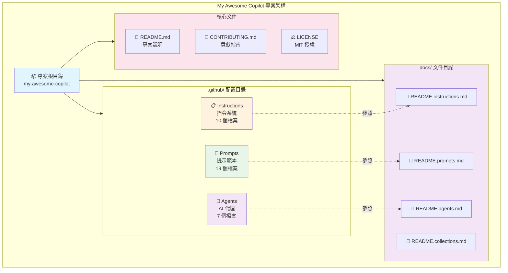

# My Awesome Copilot

一個精心設計的 GitHub Copilot 指令和提示集合，旨在提升開發者體驗並促進最佳實踐的採用。

> A curated collection of GitHub Copilot instructions and prompts designed to enhance developer experience and promote best practices.

[](LICENSE)
[](https://github.com/rockexe0000/my-awesome-copilot/issues)
[](https://github.com/rockexe0000/my-awesome-copilot/stargazers)
[](CONTRIBUTING.md)

## 目錄 / Table of Contents

- [專案概述 / Project Overview](#專案概述--project-overview)
- [核心特色 / Key Features](#核心特色--key-features)
- [系統架構 / System Architecture](#系統架構--system-architecture)
- [技術堆疊 / Technology Stack](#技術堆疊--technology-stack)
- [環境需求 / Prerequisites](#環境需求--prerequisites)
- [快速開始 / Quick Start](#快速開始--quick-start)
- [專案結構 / Project Structure](#專案結構--project-structure)
- [使用範例 / Usage Examples](#使用範例--usage-examples)
- [最佳實踐 / Best Practices](#最佳實踐--best-practices)
- [文件管理建議 / Documentation Management](#文件管理建議--documentation-management)
- [貢獻 / Contributing](#貢獻--contributing)
- [支援 / Support](#支援--support)
- [授權 / License](#授權--license)

---

## 專案概述 / Project Overview

My Awesome Copilot 是一個全面的 GitHub Copilot 指令和提示系統，專為提升軟體開發效率與程式碼品質而設計。本專案整合了業界最佳實踐、安全規範和效能優化策略，透過結構化的指令系統和可重用的提示範本,幫助開發團隊建立一致的開發標準。

> My Awesome Copilot is a comprehensive GitHub Copilot instructions and prompts system designed to enhance software development efficiency and code quality. This project integrates industry best practices, security standards, and performance optimization strategies through structured instruction systems and reusable prompt templates, helping development teams establish consistent development standards.

### 核心目標 / Core Goals

- **標準化開發實踐** - 通過一致的指令確保程式碼品質和架構決策
- **提升開發效率** - 提供現成的提示範本來處理常見的開發任務
- **促進最佳實踐** - 整合 DevOps、安全性、效能最佳化等業界標準
- **增強程式碼品質** - 透過自動化檢查和建議來維持高程式碼標準

---

## 核心特色 / Key Features

### 全面的指令系統 (10 個)

涵蓋軟體開發全生命週期的指令集,自動套用到相關檔案類型:
- **開發流程** - Spec-driven Workflow、Memory Bank、處理追蹤
- **程式碼品質** - 註解規範、行為控制、Markdown 標準
- **安全性** - OWASP Top 10 安全編碼實踐
- **效能** - 前端/後端/資料庫全方位優化
- **DevOps** - CALMS 框架、DORA 指標、Docker 最佳實踐

📖 **[查看完整指令系統文件 →](docs/README.instructions.md)**

### 豐富的提示範本 (19 個)

預建的提示檔案用於常見開發工作流程:
- **文件產生** - README、ADR、實作計劃、規格文件
- **開發輔助** - Conventional Commits、Prompt Builder
- **程式碼品質** - 審查重構、文件索引更新
- **專案發現** - 建議 Instructions/Prompts

📖 **[查看完整提示範本文件 →](docs/README.prompts.md)**

### 智慧 AI 代理 (7 個)

專業領域的智慧助手,使用 `@agent-name` 啟用:
- **架構設計** - 產生完整架構圖表與 NFR 分析
- **文件查詢** - 即時查詢最新函式庫文件
- **測試自動化** - Playwright 測試腳本產生
- **PRD 產生** - 產品需求文件自動化
- **工程指導** - 首席工程師級程式碼審查
- **批判思考** - 挑戰假設與決策驗證
- **IaC 專家** - Terraform 自動化部署

📖 **[查看完整 AI 代理文件 →](docs/README.agents.md)**

### Collections 系統 (4 個主題)

主題式資源索引,透過 YAML + Markdown 雙檔案結構組織相關工具:
- **Documentation Workflow** (9 項) - 文件建立完整工具鏈
- **Code Quality & Security** (5 項) - 程式碼品質與安全
- **DevOps Pipeline** (3 項) - CI/CD 與基礎設施
- **Meta Development** (8 項) - Copilot 資源產生器

每個 Collection 包含：
- `.collection.yml` - 機器可讀的資源索引 (YAML 格式)
- `.md` - 人類可讀的說明文件 (Markdown 格式)

📖 **[查看完整 Collections 文件 →](docs/README.collections.md)**

---

## 系統架構 / System Architecture

### 專案組織結構圖



### 三大核心系統

| 系統 | 數量 | 觸發方式 | 主要用途 | 詳細文件 |
|------|------|---------|---------|---------|
| **📋 Instructions** | 10 個 | 自動載入 | 程式碼生成規範、最佳實踐自動套用 | [查看文件](docs/README.instructions.md) |
| **📝 Prompts** | 19 個 | 手動呼叫 | 文件產生、計劃建立、程式碼審查 | [查看文件](docs/README.prompts.md) |
| **🤖 Agents** | 7 個 | `@` 標記 | 專業領域諮詢、架構設計、測試自動化 | [查看文件](docs/README.agents.md) |

---

## 技術堆疊 / Technology Stack

本專案是一個純文件與配置專案,不涉及執行時程式碼。主要使用以下技術:

### 文件格式 / Documentation Formats

| 技術 | 用途 / Purpose |
|------|---------------|
| **Markdown** | 所有文件和配置的主要格式 |
| **YAML Front Matter** | 用於指令和提示的元資料定義 (applyTo, description) |
| **Mermaid** | 架構圖和流程圖繪製 (系統架構、工作流程視覺化) |
| **JSON** | 配置檔案和結構化資料 |

### 開發工具 / Development Tools

| 工具 | 版本需求 | 用途 / Purpose |
|------|---------|---------------|
| **GitHub Copilot** | 最新版 | 核心整合平台 - 自動載入指令、提示和代理 |
| **VS Code** | >= 1.80 | 推薦的編輯器 (完整支援 GitHub Copilot 功能) |
| **Git** | >= 2.0 | 版本控制系統 |

### 檔案命名規範 / File Naming Conventions

| 類型 | 命名格式 | 觸發方式 | 範例 |
|------|---------|---------|------|
| **Instructions** | `*.instructions.md` | 自動載入 (根據 applyTo 規則) | `security-and-owasp.instructions.md` |
| **Prompts** | `*.prompt.md` | 手動觸發 (`Follow instructions in [file]`) | `create-readme-comprehensive.prompt.md` |
| **Agents** | `*.agent.md` | 互動式使用 (`@agent-name`) | `arch.agent.md` |

### 專案特性 / Project Characteristics

- **無執行時相依性** - 純文件專案,無需編譯或建構
- **即插即用** - 複製到專案即可使用
- **跨語言支援** - 指令適用於 TypeScript, Python, Java, Go, C# 等
- **可擴充性** - 易於新增自訂指令、提示和代理

---

## 環境需求 / Prerequisites

### 必要條件 / Required

> [!IMPORTANT]
> 使用本專案前,請確保您已滿足以下條件:

- **GitHub Copilot 訂閱** - 個人版、商業版或企業版
  - [申請試用](https://github.com/features/copilot) 或 [購買訂閱](https://docs.github.com/en/billing/managing-billing-for-github-copilot)
- **支援的編輯器** - VS Code (推薦) 或其他支援 GitHub Copilot 的 IDE
  - [VS Code 下載](https://code.visualstudio.com/)
  - [GitHub Copilot 擴充功能](https://marketplace.visualstudio.com/items?itemName=GitHub.copilot)

### 建議配置 / Recommended

- **Git** >= 2.0 - 用於專案複製和版本控制
- **基礎 Markdown 知識** - 用於閱讀和自訂指令、提示
- **YAML 基礎** - 用於理解 front matter 元資料配置

### 驗證環境 / Environment Verification

安裝完成後,請執行以下檢查:

```bash
# 檢查 Git 版本
git --version
# 預期輸出: git version 2.x.x 或更高

# 檢查 VS Code 版本
code --version
# 預期輸出: 1.80.x 或更高
```

在 VS Code 中驗證 GitHub Copilot:

- [ ] GitHub Copilot 圖標出現在狀態列 (右下角)
- [ ] 點擊圖標顯示 "GitHub Copilot is active"
- [ ] 開啟 Copilot Chat (快捷鍵: `Ctrl+Alt+I` / `Cmd+Option+I`)
- [ ] 在 Chat 中輸入 `@` 可以看到可用的代理列表

---

## 快速開始 / Quick Start

### 安裝 / Installation

```bash
# 複製專案儲存庫 (Clone repository)
git clone https://github.com/rockexe0000/my-awesome-copilot.git
cd my-awesome-copilot
```

### 整合到現有專案 / Integration

#### 方法 1: 複製指令檔案 (Copy Instructions)

```bash
# 複製指令檔案到您的專案 (Copy instructions to your project)
cp -r instructions /path/to/your/project/.github/

# 複製提示範本 (Copy prompt templates)
cp -r prompts /path/to/your/project/.github/

# 複製 AI 代理 (Optional: Copy AI agents)
cp -r agents /path/to/your/project/.github/
```

#### 方法 2: Git Submodule (Recommended)

```bash
# 在您的專案中加入為 submodule (Add as submodule)
cd /path/to/your/project
git submodule add https://github.com/rockexe0000/my-awesome-copilot.git .github/copilot-config

# 建立符號連結 (Create symbolic links)
ln -s .github/copilot-config/instructions .github/instructions
ln -s .github/copilot-config/prompts .github/prompts
ln -s .github/copilot-config/agents .github/agents
```

### 基本使用 / Basic Usage

#### 使用指令 / Using Instructions

指令會自動套用到相關檔案類型,無需手動操作。例如:
- 編輯 `.ts` 檔案時,安全性和效能指令會自動載入
- 編輯 `Dockerfile` 時,容器化最佳實踐會自動套用
- 編輯 `.md` 檔案時,Markdown 規範會自動啟用

📖 **[了解更多指令使用方式 →](docs/README.instructions.md)**

#### 使用提示範本 / Using Prompts

在 GitHub Copilot Chat 中輸入 `/` 查看可用的 prompts,或使用以下格式:

```markdown
# 產生繁中雙語 README (推薦)
Follow instructions in [create-readme-comprehensive.prompt.md](file:///prompts/create-readme-comprehensive.prompt.md)

# 標準化 Git 提交
Follow instructions in [conventional-commit.prompt.md](file:///prompts/conventional-commit.prompt.md)
```

📖 **[查看所有 19 個提示範本 →](docs/README.prompts.md)**

#### 使用 AI 代理 / Using Agents

在 GitHub Copilot Chat 中使用 `@` 標記:

```bash
# 架構設計
@arch 設計一個微服務架構

# 查詢最新文件
@context7 React 19 的新功能

# 建立測試
@playwright 產生登入流程測試
```

📖 **[查看所有 7 個 AI 代理 →](docs/README.agents.md)**

---

## 專案結構 / Project Structure

```
my-awesome-copilot/
├── agents/                       # 🤖 AI 代理配置 (7 個)
├── instructions/                 # 📋 GitHub Copilot 指令 (10 個)
├── prompts/                      # 📝 提示範本 (19 個)
├── collections/                  # 📦 主題式資源索引 (4 個)
├── docs/                         # 📚 詳細文件
│   ├── README.agents.md         # AI 代理完整文件
│   ├── README.collections.md    # Collections 完整文件
│   ├── README.instructions.md   # 指令系統完整文件
│   └── README.prompts.md        # 提示範本完整文件
├── scripts/                      # 🔧 工具腳本
├── temp/                         # 🗂️ 暫存檔案
├── CONTRIBUTING.md               # 貢獻指南
├── LICENSE                       # MIT 授權
└── README.md                     # 本檔案
```

### 目錄說明 / Directory Description

| 目錄 / Directory | 數量 | 用途 / Purpose | 詳細文件 |
|-----------------|------|---------------|---------|
| `agents/` | 7 個 | AI 代理配置檔案,提供專業領域的輔助功能 | [查看](docs/README.agents.md) |
| `instructions/` | 10 個 | GitHub Copilot 指令,定義程式碼產生規則和最佳實踐 | [查看](docs/README.instructions.md) |
| `prompts/` | 19 個 | 可重用的提示範本,用於常見開發任務 | [查看](docs/README.prompts.md) |
| `collections/` | 4 個 | 主題式資源索引,透過 YAML + MD 參照相關檔案 | [查看](docs/README.collections.md) |
| `docs/` | 4 個 | 專案詳細文件,包含各子系統的完整參考指南 | - |
| `temp/` | - | 暫存工作區,用於實驗和草稿 (不納入版本控制) | - |

> [!NOTE]
> 使用時需要將 `agents/`, `instructions/`, `prompts/` 目錄複製或符號連結到 `.github/` 目錄下,以便 GitHub Copilot 自動載入。

---

## 使用範例 / Usage Examples

### 情境 1: 開始新專案

**步驟 1**: 建立專案 README

```markdown
# 繁體中文專案 (推薦)
Follow instructions in [create-readme-comprehensive.prompt.md](file:///.github/prompts/create-readme-comprehensive.prompt.md)

# 英文國際專案 (快速)
Follow instructions in [create-readme-quick.prompt.md](file:///.github/prompts/create-readme-quick.prompt.md)
```

**步驟 2**: 產生 Copilot 指令檔案

```markdown
Follow instructions in [copilot-instructions-blueprint-generator.prompt.md](file:///.github/prompts/copilot-instructions-blueprint-generator.prompt.md)
```

**步驟 3**: 建立技術堆疊文件

```markdown
Follow instructions in [technology-stack-blueprint-generator.prompt.md](file:///.github/prompts/technology-stack-blueprint-generator.prompt.md)
```

### 情境 2: 開發新功能

**步驟 1**: 建立實作計劃

```markdown
Follow instructions in [create-implementation-plan.prompt.md](file:///.github/prompts/create-implementation-plan.prompt.md)
```

**步驟 2**: 在 Memory Bank 中追蹤進度

使用 `add task` 命令建立新任務,或 `update task [ID]` 更新現有任務狀態。

**步驟 3**: 遵循 Spec-driven Workflow

按照六階段循環進行開發 (分析 → 設計 → 實作 → 驗證 → 反思 → 交接)。

### 情境 3: 提升程式碼品質

**步驟 1**: 進行程式碼審查和重構

```markdown
Follow instructions in [review-and-refactor.prompt.md](file:///.github/prompts/review-and-refactor.prompt.md)
```

**步驟 2**: 檢查安全性問題

確保 `security-and-owasp.instructions.md` 指令已啟用,Copilot 會自動檢查常見的安全漏洞。

**步驟 3**: 優化效能

參考 `performance-optimization.instructions.md` 中的最佳實踐進行效能調整。

### 情境 4: 容器化部署

**步驟 1**: 建立 Dockerfile

在編輯 Dockerfile 時,`containerization-docker-best-practices.instructions.md` 會自動提供建議。

**步驟 2**: 設定 CI/CD

參考 `devops-core-principles.instructions.md` 建立自動化部署流程。

**步驟 3**: 記錄架構決策

```markdown
Follow instructions in [create-architectural-decision-record.prompt.md](file:///.github/prompts/create-architectural-decision-record.prompt.md)
```

### 情境 5: 標準化 Git 工作流程

**提交程式碼時**:

```markdown
Follow instructions in [conventional-commit.prompt.md](file:///.github/prompts/conventional-commit.prompt.md)
```

這會產生符合 Conventional Commits 規範的提交訊息並自動執行提交。

---

## 最佳實踐 / Best Practices

### 檔案命名與目錄結構規範

#### 檔案命名規則

**必須使用 kebab-case (小寫加連字號):**

```markdown
✅ 正確範例:
- getting-started.md
- installation-guide.md
- api-reference.md

❌ 錯誤範例:
- GettingStarted.md (駝峰式)
- install_guide.md (蛇形)
- API-Reference.md (混合大小寫)
```

**命名原因:**
- **URL 友善**: Linux 伺服器區分大小寫,kebab-case 避免連結錯誤
- **SEO 最佳化**: 搜尋引擎將連字號視為字詞分隔符
- **可讀性**: 比底線 `_` 更清晰易讀
- **業界標準**: GitHub、GitLab 等平台的慣例

#### 標準目錄架構

```
project-root/
├── README.md                 # 專案概述 (必須)
├── CONTRIBUTING.md           # 貢獻指南 (建議)
├── LICENSE                   # 授權檔案 (必須)
├── docs/                     # 📚 文件根目錄
│   ├── getting-started.md   # 快速開始
│   ├── api/                 # API 文件
│   ├── guides/              # 進階指南
│   └── assets/images/       # 圖片資源
└── src/                     # 原始程式碼
```

📖 **[查看完整最佳實踐指南 →](docs/README.instructions.md#最佳實踐)**

### 指令檔案自訂

1. **根據專案需求調整**：修改指令檔案中的技術堆疊和架構模式
2. **保持版本同步**：確保指令與專案使用的框架版本一致
3. **團隊協作**：讓團隊成員共同維護和改進指令

### 提示有效使用

1. **選擇適當的提示**：根據任務類型選擇最合適的提示範本
2. **提供足夠的上下文**：在使用提示時提供必要的專案資訊
3. **迭代改進**：基於使用經驗持續改進提示內容

---

## 貢獻 / Contributing

歡迎貢獻！請查看我們的貢獻指南：

1. Fork 專案
2. 建立功能分支
3. 提交您的更改
4. 推送到分支
5. 開啟 Pull Request

詳細資訊請參閱 [CONTRIBUTING.md](CONTRIBUTING.md)。

---

## 支援 / Support

如果您遇到問題或有建議，請：

1. 檢查[現有 Issues](https://github.com/rockexe0000/my-awesome-copilot/issues)
2. [建立新的 Issue](https://github.com/rockexe0000/my-awesome-copilot/issues/new)
3. 提供詳細的問題描述和重現步驟

---

## 授權 / License

本專案採用 MIT 授權。詳見 [LICENSE](LICENSE) 檔案。

---

## 參考來源

本專案靈感來自並參考了以下優秀的開源專案：

- [github/awesome-copilot](https://github.com/github/awesome-copilot) - GitHub 官方的 Copilot 資源集合

---

⭐ 如果這個專案對您有幫助,請給我們一個星星!
